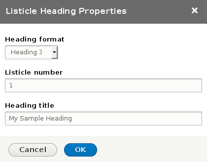

# Listicle Heading #

A CKEditor plugin for Drupal 8 to create headings preceded by a number and a dot.



## Example ##

Using the CKEditor plugin you can enter the heading format (h2, h3, etc.) a number and the heading text. This would be the source code created:

```
<div class="listicle-heading">
<h3><span class="number">1</span><span class="separator">. </span><span class="title">My Sample Heading</span></h3>
</div>
```

### 1. My Sample Heading ###
